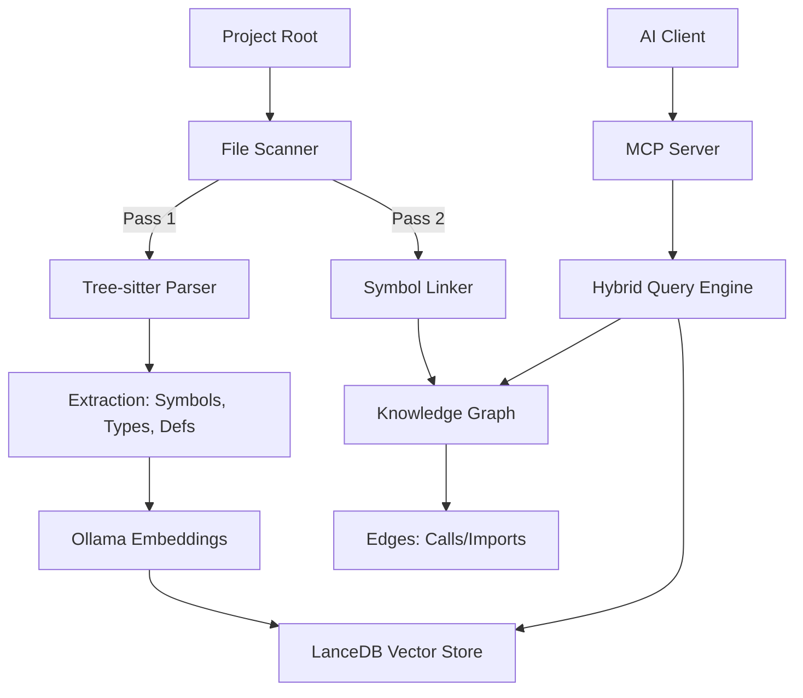

# Code Intelligence MCP Server 🧠

[](https://www.python.org/downloads/)
[](https://opensource.org/licenses/MIT)
[](https://modelcontextprotocol.io)
[](https://codecov.io/gh/nairraf/code-intel)

Give your AI agents a "brain" that actually understands your codebase. This Model Context Protocol (MCP) server provides high-performance semantic search and deep code insights, making it easier for AI tools to navigate, understand, and modify complex projects.

**This is not just a search tool; it is an analysis engine.** While standard Indexers just treat files as pure text, `code-intel` parses your codebase into a living knowledge graph. It maps abstract syntax trees (ASTs), dynamic dependencies, and architectural patterns, allowing your AI to enforce strict methodologies, understand blast radiuses, and confidently pair-program on enterprise-grade software.

---

## 🚀 Get Started

The server requires **Ollama** to handle local embeddings.

1.  **Install & Download Model**:
    Download [Ollama](https://ollama.com) and pull the high-precision embedding model:
    ```bash
    ollama pull unclemusclez/jina-embeddings-v2-base-code
    ```
2.  **Add to MCP Configuration**:
    Add the following to your AI client's MCP settings (e.g., Claude Desktop or Antigravity `mcp_config.json`). Replace `/path/to/code-intel` with the absolute path to this project.
    
    ```json
    {
      "mcpServers": {
        "code-intel": {
          "command": "uv",
          "args": ["run", "--quiet", "--directory", "/path/to/code-intel", "python", "-m", "src.server"],
          "env": { "PYTHONUNBUFFERED": "1" }
        }
      }
    }
    ```
3.  **Use it!** Your AI assistant will automatically connect to Ollama and begin indexing your project upon the first query.

---

## 🎯 Unique Advantages for Structured Engineering

While many tools offer basic semantic search, `code-intel` is purpose-built to enforce strict architectural rules and support advanced software engineering methodologies:

*   **Project Pulse & Health Metrics**: Go beyond simple search. The internal engine actively identifies "Dependency Hubs" and "High-Risk Symbols" (files with high complexity but low test coverage), guiding refactoring efforts and enforcing test-gated workflows.
*   **Deep Framework Analysis**: Standard indexers often fail at mapping dynamic patterns. This server specifically tracks dynamic dependency injection (like Python's `Depends()`) and framework-specific middleware, allowing developers to keep business logic pure and fully mockable.
*   **Targeted Re-Indexing**: Working in a massive mono-repo? You don't need to re-index the entire universe. Use targeted `include`/`exclude` patterns to update the knowledge graph on-the-fly for only the microservice or module you are actively developing.
*   **Contract-First Validation**: By exposing the precise call graph and interface definitions, `code-intel` helps validate that implementations adhere to established API contracts and structural patterns before code is committed.

---

## � Why Code Intelligence?

AI models often struggle with large codebases because they can't "see" everything at once. This server acts as a **smart bridge**, solving several key challenges:

* **Token Savings**: Instead of dumping your entire codebase into a Cloud AI's context (which is expensive and slow), this server finds the *exact* relevant snippets.
* **Smarter Context**: Locates code by meaning, not just keywords, ensuring the AI gets the context it actually needs.
* **Deep Relationships**: Maps how your code is connected—calls, definitions, and module interactions—so the AI can trace logic across files.
* **Superior Code Embeddings**: Optimized for `jina-embeddings-v2-base-code`, which provides high-precision retrieval for 80+ programming languages.
* **Cost & Speed Efficiency**: Local embedding caching prevents redundant processing, saving time and compute resources.

---

## 🏗️ Technical Architecture

Code Intelligence uses a **Two-Pass Indexing** strategy to map your codebase into a hybrid search system.



---

## ✨ Key Features

### Intelligent Caching

Our embedding cache drastically reduces latency. By storing "fingerprints" of your code locally, we avoid re-calculating embeddings for unchanged files, making searches nearly instantaneous.

### Semantic "Meaning-Based" Search

Go beyond simple keyword matching. Search for concepts like "how do we handle user authentication?" and find the relevant logic even if the exact words aren't used.

### Cross-File Architecture Graph

A persistent knowledge graph tracks imports and function calls across your entire project. This enables precise "Jump to Definition" and "Find References" that work reliably across many files, including advanced structural tracking for Dart widget instantiations and Python dependency injection (`Depends()`).

### Security & Quality Hardened

Independently audited and remediated against OWASP Top 10 vulnerabilities. Includes robust sanitization for vector filters, safe JSON-based serialization, and strict path containment.

---

## 🛠️ Tools & Usage

### Supported Tools

| Tool | Benefit to Cloud AI |
|:---|:---|
| `search_code` | **Token Saver**: Feeds the AI only the specific logic it needs to solve a task. |
| `get_stats` | **Strategic Overview**: Identifies "Dependency Hubs" and "High-Risk" areas. |
| `find_definition` | **Precise Navigation**: Jumps straight to the source of any symbol. |
| `find_references` | **Impact Analysis**: Helps the AI understand side-effects across files. |
| `refresh_index` | **On-Demand Sync**: Manually triggers a scan to update the code map. |

### 💡 Example AI Prompts

Try asking your AI agent:

* **Architecture Onboarding**: *"Give me a high-level overview of the dependency hubs in this project and identify any potential technical debt."*
* **Code Navigation**: *"Find where the `AuthenticationService` is defined and show me all the places it is referenced."*
* **Concept Search**: *"How does this project handle error logging across different modules?"*
* **Impact Analysis**: *"I'm planning to refactor the `StorageProvider`. Find all external dependencies that might be affected."*

---

## 🌐 Supported Languages

While we support 80+ languages via Tree-sitter, we provide optimized resolution for:

* **Python** (Advanced import resolution, FastAPI/Flask dependency injection)
* **Dart / Flutter** (Package resolution, Widget structural mapping)
* **TypeScript / JavaScript** (ESM/CommonJS module resolution)
* **Go & Rust**

---

## ⚙️ Quick Setup

The server requires **Ollama** to handle local embeddings.

1. **Install Ollama**: Download from [ollama.com](https://ollama.com).
2. **Download the Model**:

    ```bash
    ollama pull unclemusclez/jina-embeddings-v2-base-code
    ```

3. **Setup Environment**:

    ```bash
    uv sync
    # Or: pip install -e .
    ```

---

## 📦 Configuration

Add the following to your MCP settings. Replace `/path/to/code-intel` with the actual absolute path.

**Antigravity/Cursor/Claude Desktop**

```json
{
  "mcpServers": {
    "code-intel": {
      "command": "uv",
      "args": ["run", "--quiet", "--directory", "/path/to/code-intel", "python", "-m", "src.server"],
      "env": { "PYTHONUNBUFFERED": "1" }
    }
  }
}
```

---

## 🔧 Troubleshooting

| Issue | Potential Solution |
| :--- | :--- |
| **"Connection Refused"** | Ensure Ollama is running (`ollama serve`). |
| **"Model Not Found"** | Run `ollama pull` for the Jina model. |
| **"0 Chunks Indexed"** | Ensure project root path is absolute and extensions are supported. |
| **Slow Performance** | First-time indexing is resource-intensive; subsequent runs use the cache. |

---

## 🚀 Recent Updates

* **Production Scaling**: LanceDB table handle caching and batched SQLite transactions.
* **Robust Windows Support**: Fixed concurrency race conditions and standardized path normalization.
* **Scope Tuning**: Added `include`/`exclude` glob patterns for specialized indexing.
* **Security Hardening**: Integrated automated secret scanning (Gitleaks) into the CI pipeline.

---

## 🧪 License & Contributing

* **License**: Licensed under the [MIT License](LICENSE).
* **Contributing**: Pull requests are welcome! For major changes, please open an issue first.

```bash
uv run pytest tests/
```
