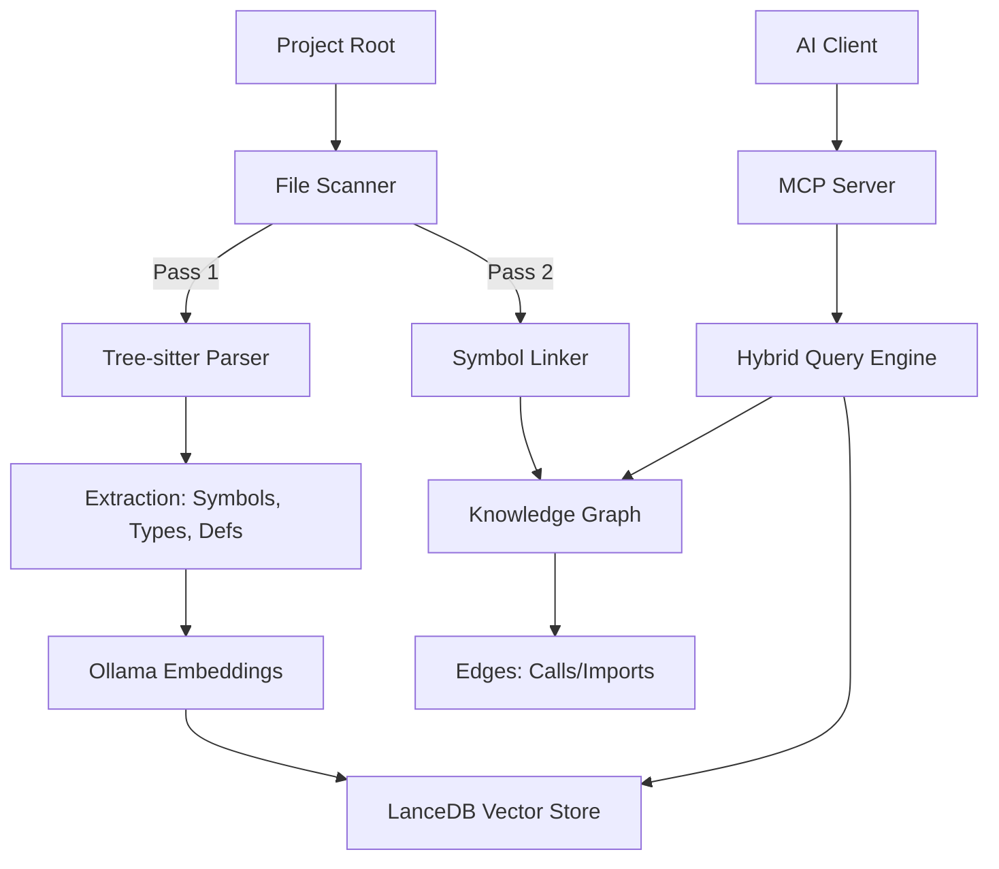

# Code Intelligence MCP Server 🧠

[](https://www.python.org/downloads/)
[](LICENSE)
[](https://modelcontextprotocol.io)
[](https://codecov.io/gh/nairraf/code-intel)

Give your AI agents a "brain" that actually understands your codebase. This Model Context Protocol (MCP) server provides high-performance semantic search and deep code insights, making it easier for AI tools to navigate, understand, and modify complex projects.

**This is not just a search tool; it is an analysis engine.** While standard Indexers just treat files as pure text, `code-intel` parses your codebase into a living knowledge graph. It maps abstract syntax trees (ASTs), dynamic dependencies, and architectural patterns, allowing your AI to enforce strict methodologies, understand blast radiuses, and confidently pair-program on enterprise-grade software.

---

## 🚀 Quick Start

### 1. Prerequisites
Install [Ollama](https://ollama.com) and pull the high-precision embedding model:
```bash
ollama pull unclemusclez/jina-embeddings-v2-base-code
```

### 2. Installation

Choose one of the following methods to set up the project:

#### Option A: Clone the Repository (Recommended)
Best for active development and staying up to date.
```bash
git clone https://github.com/nairraf/code-intel.git
cd code-intel
uv sync
```

#### Option B: Download Release (Quick Start)
Best for a one-time setup or if you don't have Git installed.
1. Download the latest [Source ZIP or Tarball](https://github.com/nairraf/code-intel/releases/latest).
2. Extract the archive to your desired location.
3. Open a terminal in the folder and run:
   ```bash
   uv sync
   ```

### 3. MCP Configuration
Add the following to your AI client's MCP settings (e.g., Claude Desktop, Cursor, or Antigravity `mcp_config.json`). Replace `/path/to/code-intel` with the absolute path to this project.

```json
{
  "mcpServers": {
    "code-intel": {
      "command": "uv",
      "args": ["run", "--quiet", "--directory", "/path/to/code-intel", "python", "-m", "src.server"],
      "env": { "PYTHONUNBUFFERED": "1" }
    }
  }
}
```

---

## 🎯 Unique Advantages for Structured Engineering

While many tools offer basic semantic search, `code-intel` is purpose-built to enforce strict architectural rules and support advanced software engineering methodologies:

*   **Project Pulse & Health Metrics**: Go beyond simple search. The internal engine actively identifies "Dependency Hubs", "High-Risk Symbols" (files with high complexity but low test coverage), tracking of Git activity alongside index freshness, and automated architectural validation (such as 200/50 file size rules). This directly guides refactoring efforts and enforces test-gated workflows.
*   **Deep Framework Analysis**: Standard indexers often fail at mapping dynamic patterns. This server specifically tracks dynamic dependency injection (like Python's `Depends()`) and framework-specific middleware, allowing developers to keep business logic pure and fully mockable.
*   **Targeted Re-Indexing**: Working in a massive mono-repo? You don't need to re-index the entire universe. Use targeted `include`/`exclude` patterns to update the knowledge graph on-the-fly for only the microservice or module you are actively developing.
*   **Contract-First Validation**: By exposing the precise call graph and interface definitions, `code-intel` helps validate that implementations adhere to established API contracts and structural patterns before code is committed.

---

## 🏗️ Technical Architecture

Code Intelligence uses a **Two-Pass Indexing** strategy to map your codebase into a hybrid search system.



---

## ✨ Key Features

### Intelligent Caching
Our embedding cache drastically reduces latency. By storing "fingerprints" of your code locally, we avoid re-calculating embeddings for unchanged files, making searches nearly instantaneous.

### Semantic "Meaning-Based" Search
Go beyond simple keyword matching. Search for concepts like "how do we handle user authentication?" and find the relevant logic even if the exact words aren't used.

The latest retrieval pipeline adds **source-first ranking** for implementation-oriented queries, helping code results outrank documentation noise in doc-heavy repositories. Search responses now also expose **Result Type** and **Query Intent** metadata so agents can reason about whether a hit is source, test, docs, or report content.

### Cross-File Architecture Graph
A persistent knowledge graph tracks imports and function calls across your entire project. This enables precise "Jump to Definition" and "Find References" that work reliably across many files, including advanced structural tracking for Dart widget instantiations and Python dependency injection (`Depends()`).

Reference tracing output now includes normalized confidence labels and explicit **Reference Kind** metadata, making it easier for agents to distinguish high-confidence structural matches from lower-confidence heuristic matches.

### Security & Quality Hardened
Independently audited and remediated against OWASP Top 10 vulnerabilities. Includes robust sanitization for vector filters, safe JSON-based serialization, and strict path containment.

---

## 🛠️ Tools & Tools Usage

| Tool | Benefit to Cloud AI |
|:---|:---|
| `search_code` | **Token Saver**: Feeds the AI only the specific logic it needs to solve a task. |
| `get_stats` | **Strategic Overview**: Identifies "Dependency Hubs" and "High-Risk" areas. |
| `find_definition` | **Precise Navigation**: Jumps straight to the source of any symbol. |
| `find_references` | **Impact Analysis**: Helps the AI understand side-effects across files. |
| `refresh_index` | **On-Demand Sync**: Manually triggers a scan to update the code map. |

### 💡 Example AI Prompts
Try asking your AI agent:
* *"Give me a high-level overview of the dependency hubs in this project and identify any potential technical debt."*
* *"Find where the `AuthenticationService` is defined and show me all the places it is referenced."*
* *"How does this project handle error logging across different modules?"*

---

## 🌐 Supported Languages
While we support 80+ languages via Tree-sitter, we provide optimized resolution for:
* **Python** (Advanced import resolution, FastAPI/Flask dependency injection)
* **Dart / Flutter** (Package resolution, Widget structural mapping)
* **TypeScript / JavaScript** (ESM/CommonJS module resolution)
* **Go & Rust**

---

## 🔧 Troubleshooting

| Issue | Potential Solution |
| :--- | :--- |
| **"Connection Refused"** | Ensure Ollama is running (`ollama serve`). |
| **"Model Not Found"** | Run `ollama pull` for the Jina model. |
| **"0 Chunks Indexed"** | Ensure project root path is absolute and extensions are supported. |
| **Slow Performance** | First-time indexing is resource-intensive; subsequent runs use the cache. |

---

## 🚀 Recent Updates
* **Agent Observability**: Integrated Git workspace activity ("dirty" status, commit hooks) with local Index Metadata to provide agents an immediate "Codebase Freshness" spot-check via `get_stats`.
* **Architectural Guardian**: Enforced the 200/50 rule directly within `get_stats`, automatically identifying codebase violations (files > 200 lines).
* **Production Scaling**: LanceDB table handle caching and batched SQLite transactions.
* **Robust Windows Support**: Fixed concurrency race conditions and standardized path normalization.
* **Scope Tuning**: Added `include`/`exclude` glob patterns for specialized indexing.
* **Retrieval Precision**: Added source-first ranking, query-intent classification, and result-type metadata for better agent search behavior.
* **Reference Clarity**: Added richer confidence and reference-kind reporting in `find_references` output.
* **Security Hardening**: Integrated automated secret scanning (Gitleaks) into CI.

---

## 🧪 License & Contributing
* **License**: [MIT License](LICENSE)
* **Contributing**: See [CONTRIBUTING.md](CONTRIBUTING.md)
* **Conduct**: See [CODE_OF_CONDUCT.md](CODE_OF_CONDUCT.md)
* **Security**: See [SECURITY.md](SECURITY.md)
