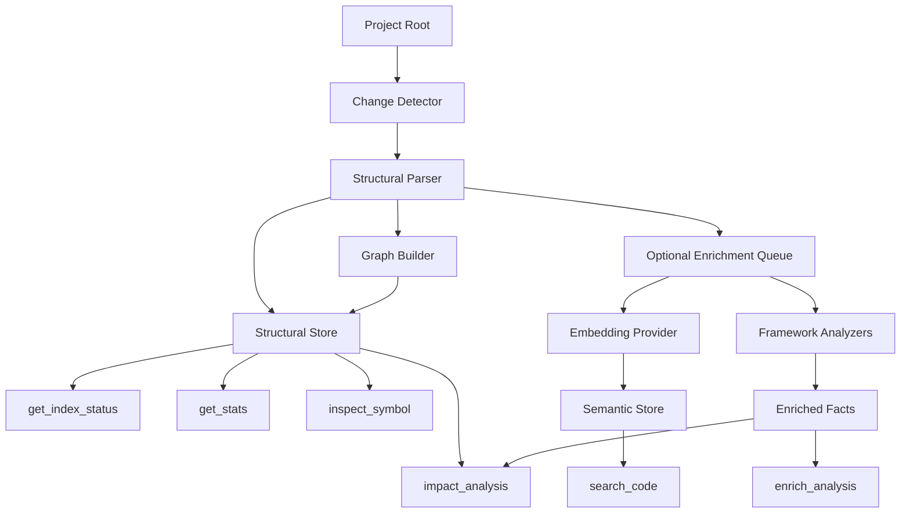

# Reboot Architecture: Structural Context Service

## Purpose

This document captures the preferred technical direction for the reboot branch.

It answers four practical questions:

1. what the reboot is trying to optimize for
2. which existing technical investments should be reused
3. which parts of the current implementation should be refactored or demoted
4. which technology choices are core versus optional

It also answers one execution question that became important during the reboot:

5. whether to keep optimizing the legacy refresh path or replace it with a smaller structural core

## Design Goal

`code-intel` should become a structural context service for coding agents.

The system should help an agent answer:

- what is important in this repository?
- what is risky to change?
- what depends on this symbol or file?
- what is likely affected by this change?
- can I trust the current index state?

The design is successful when those answers are cheap, explainable, and trustworthy.

## System Priorities

### 1. Structural Truth Before Semantic Enrichment
The structural layer is authoritative. Definitions, imports, graph edges, freshness state, and impact signals must not depend on embeddings.

### 2. Cheap Incremental Maintenance
Refresh must be designed for frequent use during active work. Expensive enrichment should be optional and scoped.

### 3. Explicit Trust Signals
Agents should not have to infer whether the index is reliable. Freshness and degraded-mode signals must be part of the contract.

### 4. Explainable Analysis
The system should return reasons and evidence, not only conclusions.

## Preferred Tool Surface

### Primary Tools
- `refresh_index`
- `get_index_status`
- `get_stats`
- `inspect_symbol`
- `impact_analysis`
- `enrich_analysis`

### Secondary Tool
- `search_code`

### Compatibility Tools
- `find_definition`
- `find_references`

## Preferred Runtime Architecture

## Implementation Mode

The branch is no longer optimizing the legacy refresh engine as the primary path.

The preferred execution mode is now:

- build a parallel minimal structural core under `src/structural_core/`
- borrow only the minimum correct pieces from the current system
- keep the legacy pipeline available only until the new core proves itself
- port tools onto the new core one at a time instead of continuing in-place stripping

This decision exists to answer the real reboot question faster. If the minimal structural core still cannot make refresh cheap and trustworthy, the reboot is likely not worth continuing.

## Storage Direction

### Structural Authority
Preferred direction:

- SQLite becomes the authority for structural state
- structural state includes manifests, refresh status, graph edges, core chunk metadata, and trust and freshness information

Why:

- SQLite is already present
- local structural data benefits from transactional behavior and simple invalidation semantics
- the reboot depends on precise, cheap, project-scoped updates more than vector-first retrieval

### Semantic And Enrichment Stores
Preferred direction:

- LanceDB remains available for semantic retrieval and enrichment support
- LanceDB is no longer treated as the authoritative home of structural truth

Why:

- semantic search is still useful
- the existing investment can be reused
- the reboot should not pay vector costs for baseline correctness

## Technology Choices

### Keep As Core
- Python 3.11+
- FastMCP
- Tree-sitter and selected grammar packages
- SQLite
- Pydantic
- httpx
- pytest, pytest-asyncio, pytest-cov, pytest-mock

### Keep As Optional Enrichment
- LanceDB
- pyarrow
- Ollama-backed embeddings

### Reevaluate Or Clean Up
- `duckdb`: keep only if it is a deliberate LanceDB dependency for the chosen runtime path
- `tree-sitter-languages`: keep only if it is intentionally used beyond explicit grammar packages and `tree-sitter-language-pack`
- direct Pydantic dependency should be declared explicitly because the source imports it directly

## Reuse Strategy

### Reuse Mostly As-Is
- parser infrastructure
- language extension maps
- language-specific import resolution
- MCP server scaffolding
- path normalization and Windows hardening
- security hardening work
- many existing parsing and resolution tests
- `get_stats` concepts such as dependency hubs and risk surfacing

### Reuse Selectively Inside The New Core
- exact symbol extraction logic from the parser
- exact import extraction logic from the parser
- path normalization and project-root handling
- focused tests that define correctness for definitions, imports, and references

### Reuse But Refactor Heavily
- refresh orchestration
- graph persistence and invalidation
- chunk persistence boundaries
- output formats for all primary tools
- metadata and freshness handling
- semantic search integration
- framework-heavy analysis paths

### Do Not Carry Into The New Core Hot Path By Default
- per-file git metadata collection during refresh
- related-test discovery during refresh
- heuristic global symbol fallback during default linking
- framework inference during default refresh
- LanceDB-backed structural lookups during refresh

### Defer Until The Reboot Proves Value
- packaging and installer work
- dashboard work
- real-time indexing on file change
- broader provider integrations
- additional retrieval tuning beyond what is needed for compatibility
- deep framework analyzers beyond the minimum useful reboot set

## Analyzer Strategy

The reboot splits analysis into two layers.

### Always-On Structural Layer
- definitions
- imports
- direct structural references
- changed-file invalidation
- core graph maintenance
- structural health metrics

### Scoped Enrichment Layer
- decorator semantics
- middleware interpretation
- dependency-injection inference
- route registration inference
- test-impact enrichment

Scoped enrichment must be:

- optional
- path-centered
- neighborhood-aware
- explicitly labeled as inferred rather than exact

## Preferred Way Forward

### Phase A
Lock the reboot contracts, benchmark protocol, and trust model.

### Phase B
Stabilize graph freshness and capture enough baseline data to know where the current path fails.

### Phase C
Build the parallel structural core with only these responsibilities:

- manifest-based change detection
- exact symbol and import extraction
- SQLite-backed structural storage
- exact structural linking
- refresh metadata and trust state

### Phase D
Port `refresh_index`, `inspect_symbol`, and `impact_analysis` onto the new structural core.

### Phase E
Only after the structural core is credible, reintroduce optional enrichment layers.

## Decision Rule

Continue the reboot only if the branch demonstrates:

1. materially cheaper partial refresh
2. materially more trustworthy incremental graph behavior
3. meaningful first-pass value from impact analysis and structural inspection

If those are not achieved, stop widening the scope.